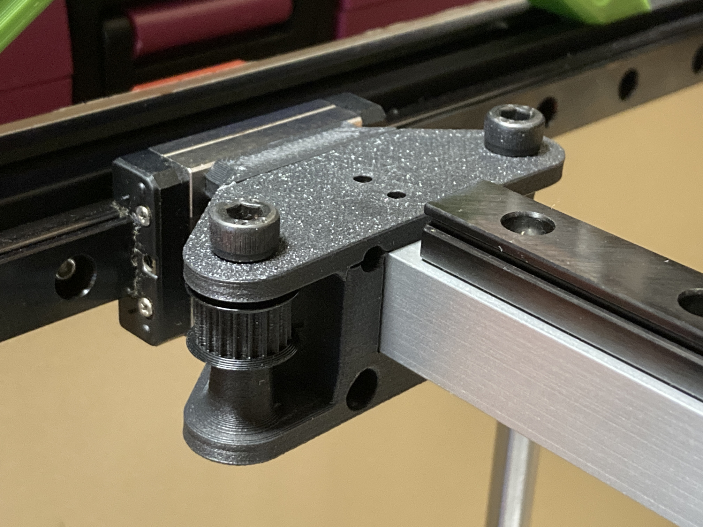

# VzBoT-practical-mods

This project is practical mods for VzBoT series 3D printers.

## Available mods

There are one mod available below.

### [Y Gantry 1515](Y-Gantry-1515)

## Authors

marbocub - Initial work

## License

Copyright (c) 2022-2023 marbocub marbocub@gmail.com, All rights reserved.

This project is licensed under the Creative Commons Attribution-NonCommercial-ShareAlike 4.0 International License (CC-BY-NC-SA 4.0) - see the [LICENSE](LICENSE) file for details.

