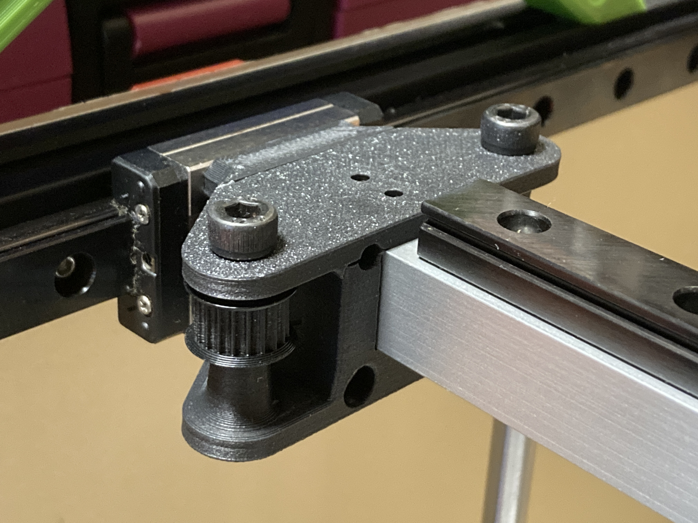
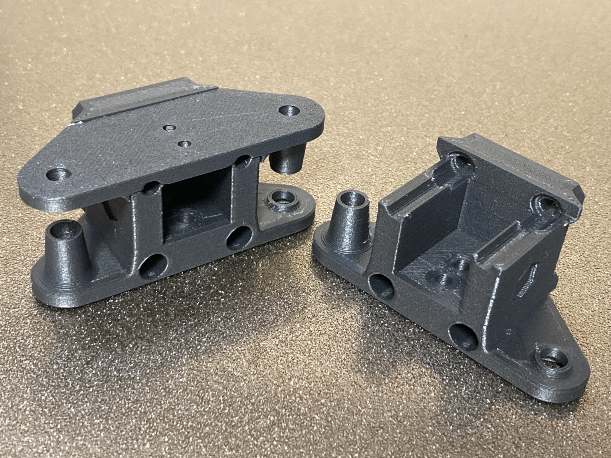
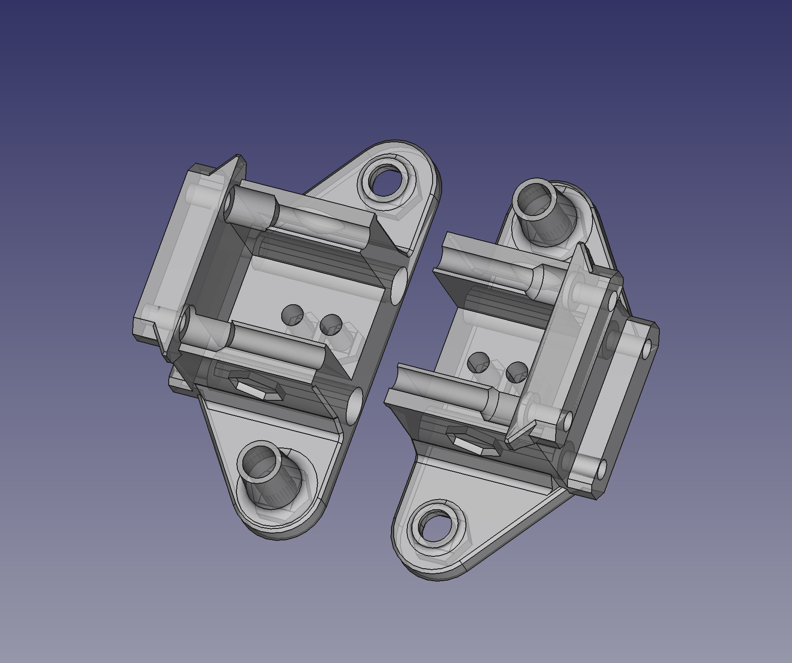

# VzBoT-practical-mods/Y-Gantry-1515

This is Y gantry (XY carriage) bottom parts for the VzBoT Vz330 used to replace X gantry from 2020 size to lighter weighted 1515 size.

The geometry and shape is based on the Vz330 V1.2's Y gantry except for minor differences and is fully compatible.

note: After the Vz330 V1.2 is released, the left and the right of the Y gantry are not common parts.  If you are using less than V1.2, please re-printing and combining Y-gantry-top-left and Y-gantry-top-right released by official VzBoT.

## BOM

|Part|STL|
|---|---|
|Left Bottom|This Y_gantry_1515_bottom_left.stl|
|Right Bottom|This Y_gantry_1515_bottom_right.stl|
|Left Top|The official Vz330 V1.2's Y_gantry_top_left.stl|
|Right Top|The official Vz330 V1.2's Y_gantry_top_right.stl|
|X end stop|The official Vz330 V1.2's XendStop.stl|

## License

Original version:
Designed and developed by: The VzBot Team.
(I can’t find other copyright notice.)

This modified version: 
The CAD is written from scratch.
Copyright (c) 2023 marbocub marbocub@gmail.com, All rights reserved.

This work is licensed under the CC-BY-NC 4.0 - see the [LICENSE-CC-BY-NC](../LICENSE-CC-BY-NC) file for details.
